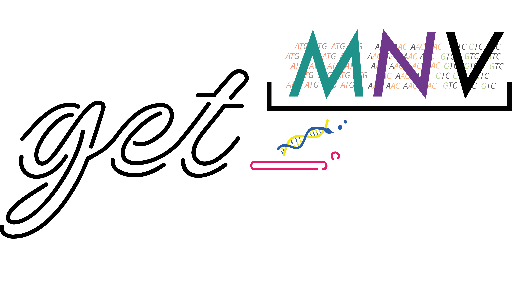
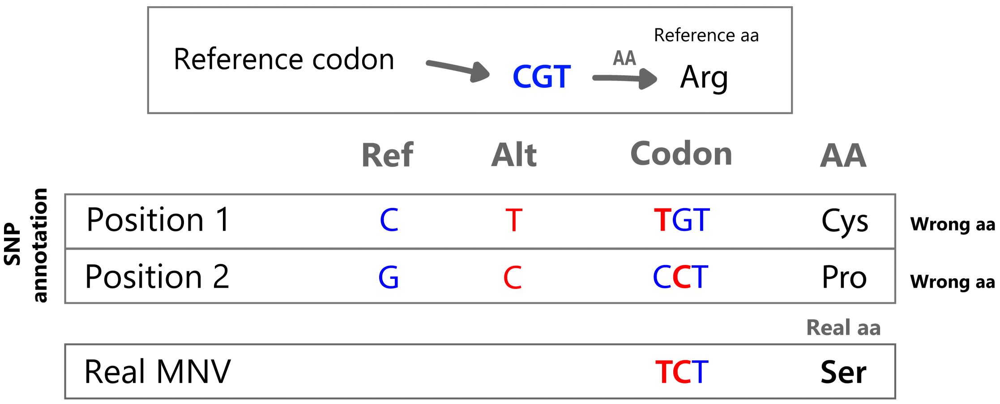

<p align="center">
  
</p>

<div align="center">

[](LICENSE)
[](https://anaconda.org/bioconda/get_mnv)
[](https://github.com/PathoGenOmics-Lab/get_MNV/releases)
[](https://doi.org/10.5281/zenodo.13907423)
[](https://github.com/PathoGenOmics-Lab)

**Multi-Nucleotide Variant detection — accurate codon-level annotation from VCF + BAM.**

[Quick Start](#quick-start) · [GUI](#desktop-gui) · [Features](#features) · [Docs](docs/) · [Citation](#citation)

</div>

__Paula Ruiz-Rodriguez<sup>1</sup>__
__and Mireia Coscolla<sup>1</sup>__
<br>
<sub> 1. Institute for Integrative Systems Biology, I<sup>2</sup>SysBio, University of Valencia-CSIC, Valencia, Spain </sub>

---

## What is get_MNV?

When multiple SNVs co-occur in the same codon, the resulting amino acid change can differ from what individual SNV annotation predicts. Standard tools like ANNOVAR or SnpEff annotate SNVs independently and miss these compound effects.

**get_MNV** detects these Multi-Nucleotide Variants (MNVs) by:

- **Grouping SNVs by codon** from VCF + reference + gene annotation
- **Recalculating amino acid changes** considering all SNVs in each codon together
- **Quantifying read support** from BAM files with strand-bias statistics
- **Classifying each variant** as SNP, MNV, or SNP/MNV based on phased read evidence

<p align="center">
  
</p>

**Key features:**
- 🧬 **Accurate MNV annotation** — codon-aware amino acid changes
- ⚡ **Fast** — 6.2× faster than v1.0 (18 ms typical, Rust + Rayon parallel)
- 📊 **Read support** — BAM-based SNP/MNV counts with strand-bias statistics
- 🧪 **9 genetic codes** — bacterial, mitochondrial, nuclear, and more
- 🖥️ **Desktop GUI** — native app via Tauri with built-in genomic track viewer
- 📁 **Multiple outputs** — TSV, VCF (plain/BGZF), BCF, JSON summary

## Installation

### Desktop GUI (pre-built)

Download the latest release for your platform:

| Platform | Download |
|---|---|
| 🍎 macOS (Apple Silicon) | [**get_MNV_1.1.1_aarch64.dmg**](https://github.com/PathoGenOmics-Lab/get_MNV/releases/latest) |
| 🍎 macOS (Intel) | [**get_MNV_1.1.1_x64.dmg**](https://github.com/PathoGenOmics-Lab/get_MNV/releases/latest) |
| 🐧 Linux | [**Releases page**](https://github.com/PathoGenOmics-Lab/get_MNV/releases/latest) |

> [!NOTE]
> **macOS users**: The app is not signed with an Apple Developer certificate. On first launch, right-click the app → **Open** → click **Open** in the dialog. See [Apple support](https://support.apple.com/en-us/HT202491) for details.

All releases: [**Releases page**](https://github.com/PathoGenOmics-Lab/get_MNV/releases)

### CLI (Bioconda)

```bash
conda install -c bioconda get_mnv
# or
mamba install -c bioconda get_mnv
```

### CLI (pre-built binary)

```bash
wget https://github.com/PathoGenOmics-Lab/get_MNV/releases/latest/download/get_mnv
chmod +x get_mnv
./get_mnv --help
```

### CLI (from source)

```bash
git clone https://github.com/PathoGenOmics-Lab/get_MNV.git
cd get_MNV
cargo install --path .
```

## Quick Start

```bash
# Basic: TSV output
get_mnv --vcf variants.vcf --fasta reference.fasta --gff genes.gff3

# With BAM reads and quality filters
get_mnv \
  --vcf variants.vcf \
  --bam reads.bam \
  --fasta reference.fasta \
  --gff genes.gff3 \
  --quality 30 \
  --mapq 20

# Both TSV + VCF output with strand-bias filtering
get_mnv \
  --vcf variants.vcf \
  --bam reads.bam \
  --fasta reference.fasta \
  --gff genes.gff3 \
  --both --vcf-gz --emit-filtered \
  --min-strand-bias-p 0.05

# Mitochondrial genome with vertebrate genetic code
get_mnv \
  --vcf mito.vcf \
  --fasta mito.fasta \
  --gff mito.gff3 \
  --translation-table 2
```

Run `get_mnv --help` for all options.

## Features

| Feature | Description |
|---|---|
| 🧬 MNV detection | Groups SNVs in the same codon and reclassifies as MNVs |
| 🔬 Accurate AA changes | Computes amino acid changes from the full codon haplotype |
| 📊 Read support | BAM-based SNP/MNV read counts with strand-specific metrics |
| 🔍 Strand bias | Fisher exact test (SB, FS, SOR) with configurable filtering |
| 📁 Multiple outputs | TSV, VCF (plain/BGZF+Tabix), BCF, JSON summary, run manifest |
| ⚡ Parallel | Multi-threaded contig processing with Rayon |
| 🧪 Genetic codes | 9 NCBI translation tables (1, 2, 3, 4, 5, 6, 11, 12, 25) |
| 🧩 Flexible input | GFF3/GTF or TSV annotations, multi-contig, multi-sample VCFs |
| ✅ Validation | Dry-run mode, strict metrics, input checksums, error JSON |
| 🖥️ Desktop GUI | Native Tauri app with drag-and-drop, genomic track viewer, dark mode |

## Desktop GUI

The desktop app provides the full get_MNV workflow with a visual interface:

- **Drag-and-drop** file selection (VCF, FASTA, GFF, BAM)
- **Multi-sample batch** — drop multiple VCFs + BAMs, auto-matched by filename
- **Parameter presets** — Default, Strict, Lenient, one click
- **Real-time progress** with per-contig status
- **Results dashboard** — variant summary, timing breakdown, per-contig stats
- **Genomic Track Viewer** — IGV-style read pileup with codon annotation, MNV/SNP comparison, coverage track, and color-coded read support
- **Export** — filter/sort variants, export filtered subset as TSV or CSV

```bash
# Build from source
cd get_MNV
cargo tauri dev       # Development
cargo tauri build     # Production
```

## Example Output

```
Chromosome  Gene      Positions       Base Changes  AA Changes  Variant Type  Change Type
MTB_anc     Rv0095c   104838          T             Asp126Glu   SNP           Non-synonymous
MTB_anc     Rv0095c   104941,104942   T,G           Gly92Gln    SNP/MNV       Non-synonymous
MTB_anc     esxL      1341102,1341103 T,C           Arg33Ser    MNV           Non-synonymous
```

**Variant types:**
- **SNP** — single nucleotide change, one SNV per codon
- **MNV** — all reads carry multiple SNVs together (Multi-Nucleotide Variant)
- **SNP/MNV** — some reads carry individual SNVs, others carry the MNV combination

## Documentation

| Document | Description |
|---|---|
| [Usage](docs/usage.md) | Full CLI reference and examples |
| [Input formats](docs/input-formats.md) | VCF, FASTA, GFF, TSV, BAM specifications |
| [Output formats](docs/output-formats.md) | TSV, VCF, BCF, JSON output details |
| [Troubleshooting](docs/troubleshooting.md) | Common errors and solutions |
| [Benchmarking](docs/benchmarking.md) | Performance testing |
| [Changelog](CHANGELOG.md) | Version history |

## Project Structure

```
get_MNV/
├── src/                      # Core library + CLI
│   ├── main.rs               # CLI entry point
│   ├── cli.rs                # Clap derive argument definitions
│   ├── genetic_code.rs       # 9 NCBI translation tables
│   ├── read_count.rs         # BAM read counting + strand metrics
│   ├── variants/             # MNV detection
│   │   ├── types.rs          #   Domain types (VariantType, ChangeType)
│   │   └── codon.rs          #   Codon grouping + AA reclassification
│   ├── io/                   # Input parsing
│   │   ├── annotation.rs     #   GFF/GTF/TSV gene loading
│   │   ├── fasta.rs          #   Zero-copy FASTA parser
│   │   ├── vcf_fast.rs       #   Fast text VCF parser
│   │   └── validation.rs     #   Input validation
│   ├── output/               # Output generation
│   │   ├── tsv.rs            #   TSV writer
│   │   ├── vcf.rs            #   VCF/BCF writer
│   │   └── stats.rs          #   Fisher exact strand bias
│   ├── pipeline/             # Orchestration
│   │   ├── mod.rs            #   Multi-threaded pipeline
│   │   └── output_paths.rs   #   Path resolution
│   └── utils.rs              # Shared utilities
├── src-tauri/                # Desktop app backend (Tauri)
├── frontend/                 # GUI (React + TypeScript)
├── docs/                     # Documentation
├── images/                   # Logo and figures
└── tests/                    # Integration tests (224 total)
```

## Limitations

- Designed for SNVs against a reference sequence
- Insertions and deletions are detected but not fully codon-annotated
- Multiallelic VCF records require `--split-multiallelic` or pre-splitting (`bcftools norm -m -`)
- VCF contig names must match FASTA and GFF exactly

## Citation

If you use get_MNV in your research, please cite:

> Ruiz-Rodriguez P, Coscolla M. **get_MNV: Multi-Nucleotide Variant detection tool.** Zenodo. doi: [10.5281/zenodo.13907423](https://doi.org/10.5281/zenodo.13907423)

```bibtex
@software{ruiz-rodriguez_get_mnv_2026,
  title     = {get\_MNV: Multi-Nucleotide Variant detection tool},
  author    = {Ruiz-Rodriguez, Paula and Coscoll{\'a}, Mireia},
  year      = {2026},
  doi       = {10.5281/zenodo.13907423},
  url       = {https://github.com/PathoGenOmics-Lab/get_MNV},
  version   = {1.1.1},
  license   = {AGPL-3.0}
}
```

## License

[GNU Affero General Public License v3.0](LICENSE)

## Fun

Click for the 3D printable logo:

<p align="center">
  <a href="https://www.printables.com/model/1030383-get_mnv-logo" target="_blank">
    
  </a>
</p>

---

<h2 id="contributors" align="center">

✨ Contributors
</h2>

<!-- ALL-CONTRIBUTORS-LIST:START -->
<div align="center">
<table>
  <tr>
    <td align="center">
      <a href="https://github.com/paururo">
        
        <br />
        <sub><b>Paula Ruiz-Rodriguez</b></sub>
      </a>
      <br />
      <a href="" title="Code">💻</a>
      <a href="" title="Research">🔬</a>
      <a href="" title="Ideas">🤔</a>
      <a href="" title="Data">🔣</a>
      <a href="" title="Design">🎨</a>
      <a href="" title="Tool">🔧</a>
    </td>
    <td align="center">
      <a href="https://github.com/mireiacoscolla">
        
        <br />
        <sub><b>Mireia Coscolla</b></sub>
      </a>
      <br />
      <a href="" title="Funding/Grant Finders">🔍</a>
      <a href="" title="Ideas">🤔</a>
      <a href="" title="Mentoring">🧑‍🏫</a>
      <a href="" title="Research">🔬</a>
      <a href="" title="User Testing">📓</a>
    </td>
  </tr>
</table>

This project follows the [all-contributors](https://github.com/all-contributors/all-contributors) specification ([emoji key](https://allcontributors.org/docs/en/emoji-key)).
</div>
<!-- ALL-CONTRIBUTORS-LIST:END -->
