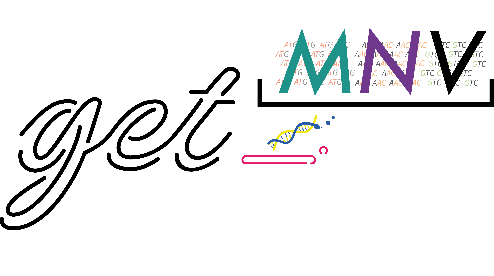
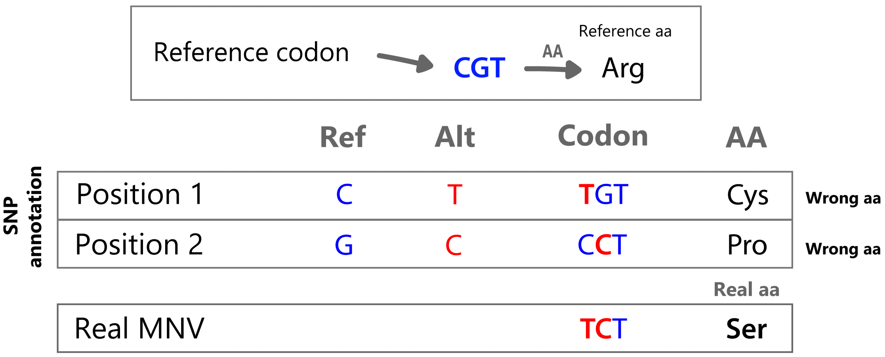

<p align="center">
  
</p>

<div align="center">

[](LICENSE)
[](https://anaconda.org/bioconda/get_mnv)
[](https://github.com/PathoGenOmics-Lab/get_MNV/releases)
[](https://doi.org/10.5281/zenodo.13907423)
[](https://github.com/PathoGenOmics-Lab)

**Multi-Nucleotide Variant detection - codon-level annotation from VCF or iVar TSV.**
**Pure Rust · no C dependencies · cross-platform (macOS, Linux, Windows)**

[Quick Start](#quick-start) · [GUI](#desktop-gui) · [Features](#features) · [Docs](docs/) · [Citation](#citation)

</div>

__Paula Ruiz-Rodriguez<sup>1</sup>__
__and Mireia Coscolla<sup>1</sup>__
<br>
<sub> 1. Institute for Integrative Systems Biology, I<sup>2</sup>SysBio, University of Valencia-CSIC, Valencia, Spain </sub>

---

## What is get_MNV?

get_MNV finds cases where two or more SNVs fall in the same codon and should be interpreted together. These combined changes can produce a different amino acid effect than the individual SNVs alone.

The tool takes:

- Variant calls: VCF or iVar `variants.tsv`
- Reference sequence: FASTA
- Gene annotation: GFF/GFF3/GTF or a simple TSV file
- Optional aligned reads: BAM, used to count SNP, MNV, and indel event support

It writes annotated variants as TSV, VCF, or both.

<p align="center">
  
</p>

**Main features:**

- Groups SNVs by codon and reports SNP, MNV, or SNP/MNV calls
- Recalculates amino acid changes from the full codon haplotype
- Decomposes VCF/iVar `REF/ALT` alleles into SNV, MNV, insertion, deletion,
  delins, and complex indel event components
- Reads VCF and iVar TSV variant calls, including iVar `+SEQ` and `-SEQ`
  indel notation
- Uses BAM reads, when provided, to count SNP/MNV support, exact indel event
  support, and strand bias
- Supports 9 NCBI genetic code tables
- Includes a desktop GUI for drag-and-drop analysis

## Installation

### Desktop GUI

Download the latest release for your platform:

| Platform | Download |
|---|---|
| 🍎 macOS (Apple Silicon) | [**get_MNV_1.1.4_aarch64.dmg**](https://github.com/PathoGenOmics-Lab/get_MNV/releases/latest) |
| 🍎 macOS (Intel) | [**get_MNV_1.1.4_x64.dmg**](https://github.com/PathoGenOmics-Lab/get_MNV/releases/latest) |
| 🐧 Linux | [**Releases page**](https://github.com/PathoGenOmics-Lab/get_MNV/releases/latest) |
| 🪟 Windows | [**Releases page**](https://github.com/PathoGenOmics-Lab/get_MNV/releases/latest) |

> [!NOTE]
> **macOS users**: The app is not signed with an Apple Developer certificate. On first launch, right-click the app → **Open** → click **Open** in the dialog. See [Apple support](https://support.apple.com/en-us/HT202491) for details.

All releases are available on the [Releases page](https://github.com/PathoGenOmics-Lab/get_MNV/releases).

### Command line

```bash
conda install -c bioconda get_mnv
```

or download a pre-built binary:

```bash
wget https://github.com/PathoGenOmics-Lab/get_MNV/releases/latest/download/get_mnv
chmod +x get_mnv
./get_mnv --help
```

or build from source:

```bash
git clone https://github.com/PathoGenOmics-Lab/get_MNV.git
cd get_MNV
cargo install --path .
```

## Quick Start

### VCF input

```bash
get_mnv \
  --vcf variants.vcf \
  --fasta reference.fasta \
  --gff genes.gff3
```

### iVar TSV input

```bash
get_mnv \
  --tsv sample_variants.tsv \
  --bam reads.bam \
  --fasta reference.fasta \
  --gff genes.gff3
```

Use `--tsv` for the `variants.tsv` file produced by `ivar variants`.

### With BAM read support

```bash
get_mnv \
  --vcf variants.vcf \
  --bam reads.bam \
  --fasta reference.fasta \
  --gff genes.gff3
```

### TSV and VCF output

```bash
get_mnv \
  --vcf variants.vcf \
  --bam reads.bam \
  --fasta reference.fasta \
  --gff genes.gff3 \
  --both \
  --summary-json run.summary.json \
  --run-manifest run.manifest.json
```

Run `get_mnv --help` for the full list of options.

## Common Arguments

| Argument | What it does |
|---|---|
| `--vcf <FILE>` | Variant input file in plain `.vcf` or BGZF-compressed `.vcf.gz` format. BCF input must be converted to VCF first. |
| `--tsv <FILE>` | iVar `variants.tsv` input file. |
| `--bam <FILE>` | Optional sorted and indexed BAM for read support. |
| `--fasta <FILE>` | Reference FASTA. Contig names must match the variant file. |
| `--gff <FILE>` | Gene annotation in GFF/GFF3/GTF format. |
| `--genes <FILE>` | Simple gene annotation TSV. Use instead of `--gff`. |
| `--gff-features <LIST>` | Feature types to analyze, for example `CDS` or `gene,pseudogene`. |
| `--quality <N>` | Minimum base Phred quality for BAM read support. Default: `20`. |
| `--min-mapq <N>` | Minimum read mapping quality when using BAM. Default: `0`. |
| `--snp <N>` | Minimum SNP-supporting reads. Default: `0`. |
| `--min-snp-frequency <F>` | Minimum BAM-derived SNP frequency, from `0` to `1`. Default: `0`. |
| `--min-snp-strand <N>` | Minimum SNP-supporting reads required on each strand. Default: `0`. |
| `--mnv <N>` | Minimum MNV-supporting reads. Default: `0`. |
| `--min-mnv-frequency <F>` | Minimum BAM-derived MNV haplotype frequency, from `0` to `1`. Default: `0`. |
| `--min-mnv-strand <N>` | Minimum MNV-supporting reads required on each strand. Default: `0`. |
| `--both` | Write both TSV and VCF outputs. |
| `--summary-json <FILE>` | Write a machine-readable run summary. |
| `--run-manifest <FILE>` | Write command, version, inputs, outputs, and checksums. |

Frequency filters use read support recalculated from `--bam`, not the original
`OFREQ` value from VCF/iVar input. Use values such as `0.05` for 5% or `0.20`
for 20%. When VCF output is requested, low-frequency records are skipped by
default or marked with `FILTER=LowFrequency` when `--emit-filtered` is enabled.
SNP and MNV frequency filters are independent: `--min-snp-frequency` applies to
individual SNP observations, while `--min-mnv-frequency` applies to the phased
MNV haplotype. In mixed `SNP/MNV` calls, a strong MNV haplotype is not removed
just because the individual SNP observations are below the SNP threshold.
The read-count and strand-support filters are independent in the same way:
`--snp` and `--min-snp-strand` apply to SNP observations, while `--mnv` and
`--min-mnv-strand` apply to the MNV haplotype.

## Outputs

By default, get_MNV writes:

```text
<input_name>.MNV.tsv
```

With `--convert` or `--both`, it also writes:

```text
<input_name>.MNV.vcf
```

The most important output fields are:

| Column | Meaning |
|---|---|
| `Chromosome` | Contig name |
| `Gene` | Gene or feature name |
| `Positions` | One position for SNPs, multiple positions for MNVs |
| `Base Changes` | Alternative bases |
| `AA Changes` | Amino acid change after combining SNVs in the codon |
| `Variant Type` | `SNP`, `MNV`, `SNP/MNV`, or `INDEL` |
| `Change Type` | Synonymous, non-synonymous, stop gained/lost, unknown, etc. |

When a BAM is provided, extra columns report read depth, SNP support, MNV support, frequency, and strand counts.

## Features

| Feature | Description |
|---|---|
| 🧬 MNV detection | Groups SNVs in the same codon and reclassifies as MNVs |
| 🔬 Accurate AA changes | Computes amino acid changes from the full codon haplotype |
| 📊 Read support | BAM-based SNP/MNV read counts with strand-specific metrics |
| 🔍 Strand bias | Fisher exact p-values for SNP and MNV strand-bias support (`SBP`/`MSBP` in VCF INFO) |
| 📁 Multiple outputs | TSV, VCF (plain/BGZF+Tabix), BCF, JSON summary, run manifest |
| ⚡ Parallel | Multi-threaded contig processing with Rayon |
| 🧪 Genetic codes | 9 NCBI translation tables (1, 2, 3, 4, 5, 6, 11, 12, 25) |
| 🧩 Flexible input | VCF or iVar TSV variant calls; GFF3/GTF or TSV annotations; multi-contig and multi-sample VCFs |
| ✅ Validation | Dry-run mode, strict metrics, input checksums, error JSON |
| 🖥️ Desktop GUI | Native Tauri app with drag-and-drop, genomic track viewer, dark mode |

## Desktop GUI

The desktop app gives the same analysis workflow in a visual interface:

- Drop VCF or iVar TSV variant files
- Drop FASTA, GFF/GTF/GFF3, and optional BAM files
- Choose common parameters from the form
- Run one sample or multiple matched samples
- Inspect, filter, and export results

```bash
bash scripts/dev.sh   # development
bash scripts/build_gui_bundle.sh  # production .app + .dmg bundle
```

## Example Output

```
Chromosome  Gene      Positions       Base Changes  AA Changes  Variant Type  Change Type
MTB_anc     Rv0095c   104838          T             Asp126Glu   SNP           Non-synonymous
MTB_anc     Rv0095c   104941,104942   T,G           Gly92Gln    SNP/MNV       Non-synonymous
MTB_anc     esxL      1341102,1341103 T,C           Arg33Ser    MNV           Non-synonymous
```

**Variant types:**
- **SNP**: single nucleotide change, one SNV per codon
- **MNV**: multiple SNVs are represented as one combined codon haplotype
- **SNP/MNV**: codon-level row with both individual SNV context and combined MNV haplotype context; with BAM, support columns distinguish the evidence
- **INDEL**: insertion, deletion, delins, or complex allele; reported with event components, exact BAM support when available, and coding effect when it overlaps an annotated CDS/gene feature

## Documentation

| Document | Description |
|---|---|
| [Usage](docs/usage.md) | Full CLI reference and examples |
| [Input formats](docs/input-formats.md) | VCF, FASTA, GFF, TSV, BAM specifications |
| [Output formats](docs/output-formats.md) | TSV, VCF, BCF, JSON output details |
| [Indel and MNV semantics](docs/indel-mnv-semantics.md) | How indels, MNVs, boundaries, and complex haplotypes are represented |
| [Troubleshooting](docs/troubleshooting.md) | Common errors and solutions |
| [Benchmarking](docs/benchmarking.md) | Performance testing |
| [Changelog](CHANGELOG.md) | Version history |

## For Developers

The core CLI and library live in `src/`. The desktop app uses Tauri in
`src-tauri/` and React/TypeScript in `frontend/`.

Useful commands:

```bash
cargo test --workspace
npm run build --prefix frontend
bash scripts/build_get_mnv.sh
bash scripts/build_gui_bundle.sh
```

### End-to-end scenario tests

`tests/scenarios/` contains a Python harness that builds synthetic FASTA,
GFF, VCF (or iVar TSV) and BAM inputs from declarative scenarios, runs
the compiled `get_mnv` binary, and checks each TSV output against
expected rows. The suite currently covers 30 scenarios including
codon-level SNP/MNV grouping, frameshift propagation, complex_indel
haplotype emission, negative-strand and multi-exon CDS annotation,
multiallelic split, and iVar TSV input.

```bash
cargo build                                # produces target/debug/get_mnv
python3 tests/scenarios/run.py             # run all 30 scenarios
python3 tests/scenarios/run.py 22 27       # run a subset by name prefix
```

Requires `samtools` on `PATH` (or `SAMTOOLS=/path/to/samtools`). See
[tests/scenarios/README.md](tests/scenarios/README.md) for the full list
of validated cases, the mini-genome layout, and how to add new scenarios.

## Limitations

- Designed for small SNV/MNV/indel events against a reference sequence
- With `--gff-features CDS`, GFF/GTF records that provide `transcript_id` or `Parent` are reconstructed as spliced CDS models, allowing exon-junction codons and transcript-level indel frameshift context to be annotated.
- Unphased heterozygous eukaryotic variants still require care: get_MNV reannotates caller alleles, but it does not re-estimate ploidy, genotype likelihoods, or long-range phase.
- Multiallelic VCF records require `--split-multiallelic` or pre-splitting (`bcftools norm -m -`)
- Variant contig names must match FASTA and GFF exactly
- **Multiple transcripts per gene**: when using `--gff-features CDS` with a GFF file that contains multiple transcripts for the same gene, each transcript is annotated independently, producing one output line per transcript per variant. If you want a single line per variant, filter your GFF to keep only the canonical transcript before running get_MNV (e.g., using [AGAT](https://github.com/NBISweden/AGAT) `agat_sp_keep_longest_isoform.pl` or a similar tool)

## Citation

If you use get_MNV in your research, please cite:

> Ruiz-Rodriguez P, Coscolla M. **get_MNV: Multi-Nucleotide Variant detection tool.** Zenodo. doi: [10.5281/zenodo.13907423](https://doi.org/10.5281/zenodo.13907423)

```bibtex
@software{ruiz-rodriguez_get_mnv_2026,
  title     = {get\_MNV: Multi-Nucleotide Variant detection tool},
  author    = {Ruiz-Rodriguez, Paula and Coscoll{\'a}, Mireia},
  year      = {2026},
  doi       = {10.5281/zenodo.13907423},
  url       = {https://github.com/PathoGenOmics-Lab/get_MNV},
  version   = {1.1.4},
  license   = {AGPL-3.0}
}
```

## License

[GNU Affero General Public License v3.0](LICENSE)

## Fun

Click for the 3D printable logo:

<p align="center">
  <a href="https://www.printables.com/model/1030383-get_mnv-logo" target="_blank">
    
  </a>
</p>

---

<h2 id="contributors" align="center">

✨ Contributors
</h2>

<!-- ALL-CONTRIBUTORS-LIST:START -->
<div align="center">
<table>
  <tr>
    <td align="center">
      <a href="https://github.com/paururo">
        
        <br />
        <sub><b>Paula Ruiz-Rodriguez</b></sub>
      </a>
      <br />
      <a href="" title="Code">💻</a>
      <a href="" title="Research">🔬</a>
      <a href="" title="Ideas">🤔</a>
      <a href="" title="Data">🔣</a>
      <a href="" title="Design">🎨</a>
      <a href="" title="Tool">🔧</a>
    </td>
    <td align="center">
      <a href="https://github.com/mireiacoscolla">
        
        <br />
        <sub><b>Mireia Coscolla</b></sub>
      </a>
      <br />
      <a href="" title="Funding/Grant Finders">🔍</a>
      <a href="" title="Ideas">🤔</a>
      <a href="" title="Mentoring">🧑‍🏫</a>
      <a href="" title="Research">🔬</a>
      <a href="" title="User Testing">📓</a>
    </td>
  </tr>
</table>

This project follows the [all-contributors](https://github.com/all-contributors/all-contributors) specification ([emoji key](https://allcontributors.org/docs/en/emoji-key)).
</div>
<!-- ALL-CONTRIBUTORS-LIST:END -->
