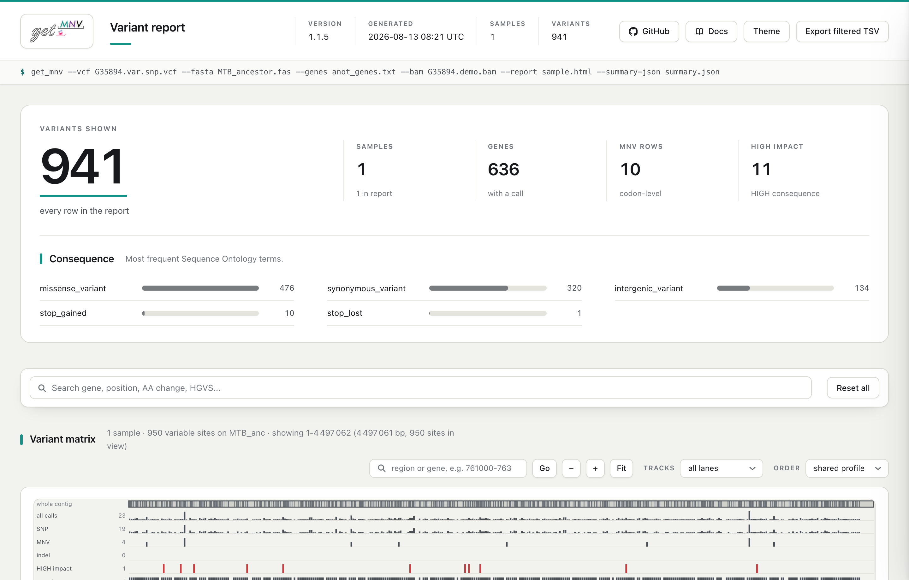

# Tutorial de línea de comandos

La línea de comandos es la interfaz principal de get_MNV: todo lo que la
herramienta sabe hacer se alcanza desde ahí, y es lo que se mete en un pipeline.
Este tutorial la ejecuta de principio a fin sobre el ejemplo de *M. tuberculosis*
que viene incluido, y dedica casi todo su espacio a lo que de verdad importa:
leer lo que devuelve.

Hay un [Tutorial de la GUI](gui-tutorial.es.md) que recorre lo mismo en la
aplicación.

## 1. Consigue los datos de ejemplo

La carpeta [`example/`](https://github.com/PathoGenOmics-Lab/get_MNV/tree/main/example)
del repositorio trae todo lo necesario:

| Archivo | Papel |
|---|---|
| `MTB_ancestor.fas` | Referencia (un único contig, `MTB_anc`) |
| `anot_genes.txt` | Tabla de genes (`nombre`, `inicio`, `fin`, `hebra`) |
| `G35894.var.snp.vcf` | Llamadas de variantes al estilo VarScan |
| `G35894.demo.bam` | Subconjunto diminuto de lecturas alineadas |

```bash
git clone https://github.com/PathoGenOmics-Lab/get_MNV.git
cd get_MNV/example
```

## 2. Anota las variantes

```bash
get_mnv \
  --vcf G35894.var.snp.vcf \
  --fasta MTB_ancestor.fas \
  --genes anot_genes.txt
```

get_MNV registra lo que ha decidido antes de registrar lo que ha encontrado. La
ejecución imprime toda su configuración, y luego las líneas que importan:

```text
[INFO get_mnv::pipeline] Using genetic code: Bacterial/Archaeal/Plant Plastid (NCBI table 11)
[INFO get_mnv::io::annotation::tsv] TSV gene entries parsed: 4008 | mapped to SNPs: 635 | without SNPs: 3373
[INFO get_mnv::pipeline::processing] Contig 'MTB_anc' -> 950 SNP/variant records in VCF, 635 mapped genes
[INFO get_mnv::pipeline::processing] Contig 'MTB_anc' -> 134 intergenic variant(s) added
[INFO get_mnv::pipeline] Summary 'MTB_anc' -> variants=941 (SNP=797, MNV=0, SNP/MNV=10, INDEL=0, intergenic=134)
[INFO get_mnv::pipeline] Processing complete. Output files generated successfully.
```

Escribe `G35894.var.snp.MNV.tsv` en el directorio actual.

!!! tip "Lee la línea de resumen, siempre"
    `950` registros se convierten en `941` variantes porque un codón que lleva
    dos sustituciones se reporta una sola vez. `SNP/MNV=10` es el trabajo a nivel
    de codón: diez codones donde se combinan registros separados del VCF.
    `MNV=0` significa que ningún registro traía ya más de una base sustituida.

    `intergenic=134` es tu comprobación de cordura sobre la anotación. get_MNV no
    puede distinguir una variante que está fuera de un gen de una variante cuyo
    gen no ha sabido encontrar, así que una anotación que no cuadra no falla:
    termina bien, reporta casi todo como intergénico e imprime
    `Processing complete`. Si esa cifra es la mayoría de tus variantes, tus
    coordenadas de genes no encajan con tu referencia.

!!! note "Código genético"
    get_MNV usa por defecto la tabla de traducción 11 del NCBI (bacteriana), que
    es la correcta para *M. tuberculosis*. Usa `--translation-table` para otros
    organismos.

Con `--dry-run` obtienes el mismo resumen sin escribir nada, que es la forma
barata de comprobar las entradas antes de una ejecución larga.

## 3. Lee la salida

Abre el TSV. Una fila destaca: el gen `Rv2036` lleva dos SNV en el mismo codón.

| Columna | Valor |
|---|---|
| `Positions` | `2282376, 2282377` |
| `Reference Bases` / `Base Changes` | `T, T` → `C, C` |
| `Reference Codon` | `GTT` |
| `SNP Codon` | `GCT, GTC` |
| `MNV Codon` | `GCC` |
| `AA Changes` | `Val93Ala` |
| `SNP AA Changes` | `Val93Ala, Val93Val` |
| `Variant Type` | `SNP/MNV` |
| `SO Term` / `Impact` | `missense_variant` / `MODERATE` |
| `HGVS g.` | `g.[2282376T>C;2282377T>C]` |

Leídas base a base, las dos sustituciones se contradicen: `GCT` es Val93Ala y
`GTC` es Val93Val, un cambio silencioso. Leídas juntas como `GCC`, el codón es
una única sustitución Val→Ala. Esa reclasificación es para lo que existe
get_MNV, y es invisible para un anotador por-SNV. Mira
[Formatos de salida](output-formats.es.md) para conocer cada columna.

## 4. Añade soporte de lecturas

La anotación dice lo que el codón *significaría*. No dice si alguna molécula
lleva de verdad los dos cambios. Para eso hay que darle los alineamientos:

```bash
get_mnv \
  --vcf G35894.var.snp.vcf \
  --fasta MTB_ancestor.fas \
  --genes anot_genes.txt \
  --bam G35894.demo.bam
```

La fila de `Rv2036` gana sus columnas de evidencia:

| Columna | Valor | Significado |
|---|---|---|
| `MNV Reads` | `24` | lecturas que llevan el haplotipo entero |
| `MNV Forward/Reverse Reads` | `12` / `12` | equilibrado entre hebras |
| `Total Reads` | `24` | profundidad en el codón |
| `MNV Frequencies` | `1.0000` | todas las lecturas que lo cruzan llevan ambos |
| `SNP Reads` | `0, 0` | lecturas que llevan un cambio *sin* el otro |
| `MNV Phasing Support` | `1.0000` | de las lecturas que podían responder, todas llevaban ambos |
| `MNV Phasing Reads` | `24` | cuántas lecturas respondieron |
| `Haplotype LD` | `-` | mira abajo |

`SNP Reads = 0, 0` junto a `MNV Reads = 24` no es un hueco: las dos columnas
reparten la evidencia en vez de contarla dos veces. Ninguna lectura lleva una
sustitución sola, así que nada cae en los recuentos sueltos.

!!! note "Por qué `Haplotype LD` está vacío en un haplotipo perfecto"
    `D'` mide si dos variantes coinciden más de lo que predicen sus propias
    frecuencias. Aquí las dos están en las 24 moléculas, así que ninguna varía y
    no queda nada que correlacionar: la respuesta honesta es `-`, no `1`. Esa es
    una pregunta distinta de la que responde `MNV Phasing Support`, que mide
    cuántas de las lecturas que podían responder llevaban el haplotipo completo,
    y contesta `1.0000`. [Ligamiento](linkage.es.md) recorre los casos en que las
    dos divergen.

!!! tip "Requisitos del BAM"
    El BAM tiene que estar ordenado por coordenada e indexado (`.bai`), y
    alineado a la misma referencia. El `G35894.demo.bam` incluido cubre solo el
    locus de `Rv2036`, y por eso las demás filas no reportan soporte.

## 5. Filtra por ese soporte

Con un BAM puedes exigir evidencia. Lo que conviene saber antes es cómo se
combinan los dos umbrales en una fila a nivel de codón:

| Comando | Filas | Qué ha pasado |
|---|---:|---|
| *(sin filtro)* | 941 | todo |
| `--snp 1` | 10 | desaparece toda fila SNP simple sin lecturas de soporte; las 10 filas a nivel de codón se quedan |
| `--mnv 5` | 941 | **no pasa nada** |
| `--snp 1 --mnv 5` | 1 | solo `Rv2036`, el único codón con lecturas |

Una fila `SNP/MNV` se conserva cuando **o bien** sus SNV individuales superan
`--snp`, **o bien** su haplotipo supera `--mnv`. Eso es deliberado, para que un
haplotipo bien soportado sobreviva aunque sus SNV individuales no lleguen. La
consecuencia es fácil de pisar: con `--snp` en su valor por defecto de `0`, el
lado SNP pasa trivialmente, así que `--mnv` por sí solo nunca quita una fila.
Sube los dos, o ninguno.

## 6. Saca un informe que puedas enviar

La misma ejecución escribe un único archivo HTML autocontenido:

```bash
get_mnv \
  --vcf G35894.var.snp.vcf \
  --fasta MTB_ancestor.fas \
  --genes anot_genes.txt \
  --bam G35894.demo.bam \
  --report sample.html
```

<div style="text-align: center;" markdown>
{ width="840" }
</div>

*El informe se abre en cualquier navegador sin servidor y viaja como un solo
adjunto. Arriba deja constancia del comando exacto que lo generó.*

Se puede buscar y filtrar, desglosa las llamadas por término de Sequence Ontology
(aquí 476 missense, 320 sinónimas, 134 intergénicas, 10 stop ganados, 1 stop
perdido) y dibuja una matriz de variantes a lo largo del contig. Para una cohorte
ya procesada con una muestra por ejecución, genera un solo informe a partir de
las salidas existentes con
`--report-from run1.MNV.tsv run2.MNV.tsv --report cohort.html`.

## 7. Lo demás que puede escribir

| Flag | Salida |
|---|---|
| `--convert` / `--both` | VCF en vez del TSV, o además de él |
| `--vcf-gz` / `--index-vcf-gz` | VCF comprimido con BGZF y su índice Tabix |
| `--bcf` | BCF convertido a partir del VCF generado |
| `--summary-json <FILE>` | el resumen de arriba, legible por máquina |
| `--run-manifest <FILE>` | comando, versión, entradas, salidas y checksums |
| `--error-json <FILE>` | detalles del error, estructurados, si la ejecución falla |

## Próximos pasos

- [Recetas habituales](usage.es.md): comandos listos para ejecutar de las tareas
  más frecuentes.
- [Referencia de CLI](cli-reference.es.md): cada opción, con su valor por
  defecto.
- [Formatos de entrada](input-formats.es.md) y
  [Formatos de salida](output-formats.es.md).
- [Alcance y compatibilidad](indel-mnv-semantics.es.md): reglas de límites y
  ajustes.
- [Ligamiento](linkage.es.md): distinguir un haplotipo real de una coincidencia.
- [Tutorial de la GUI](gui-tutorial.es.md): la misma ejecución en la aplicación.
