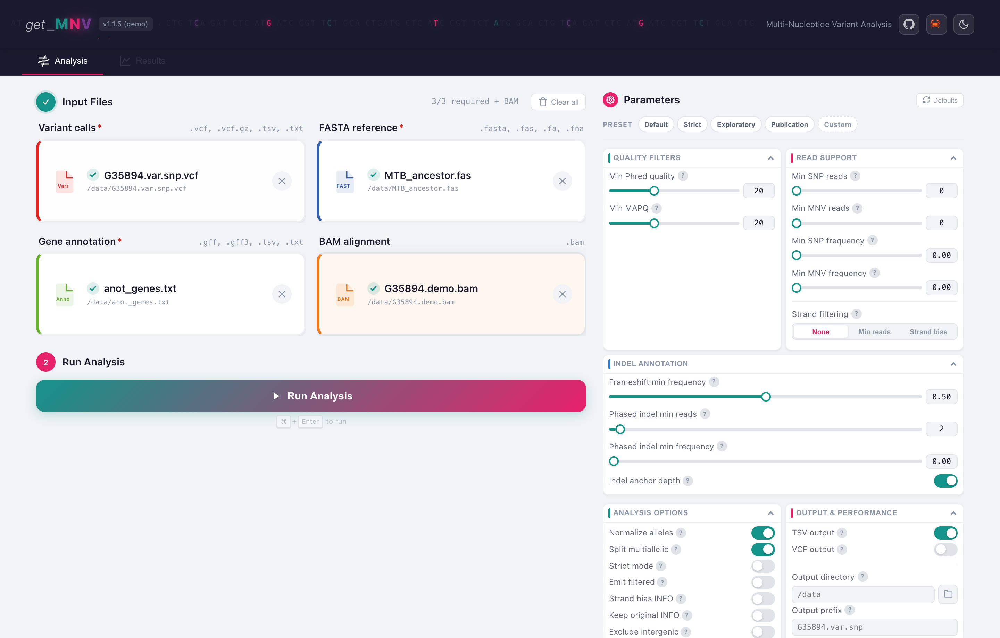
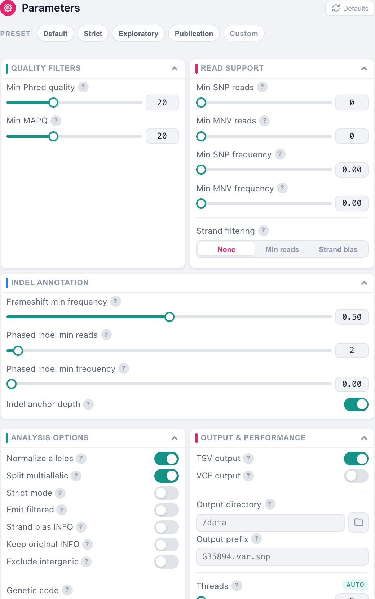
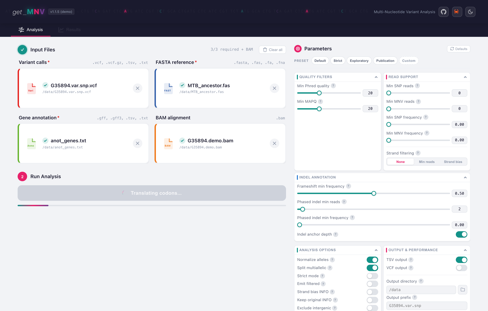
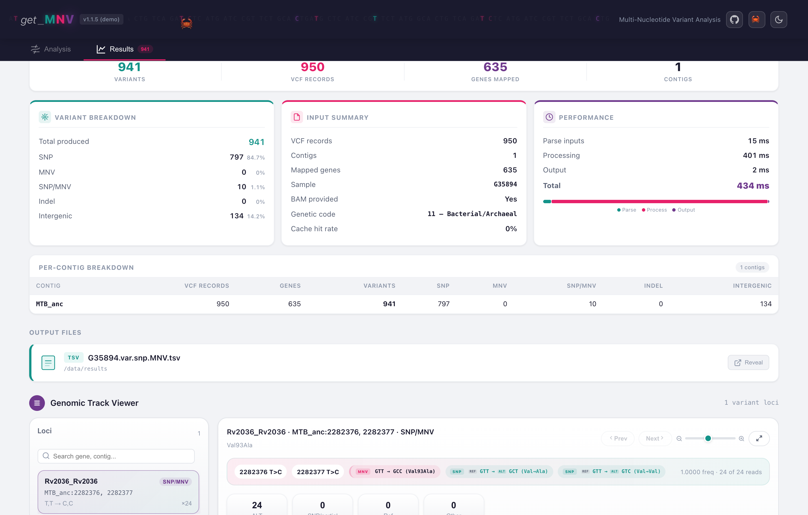
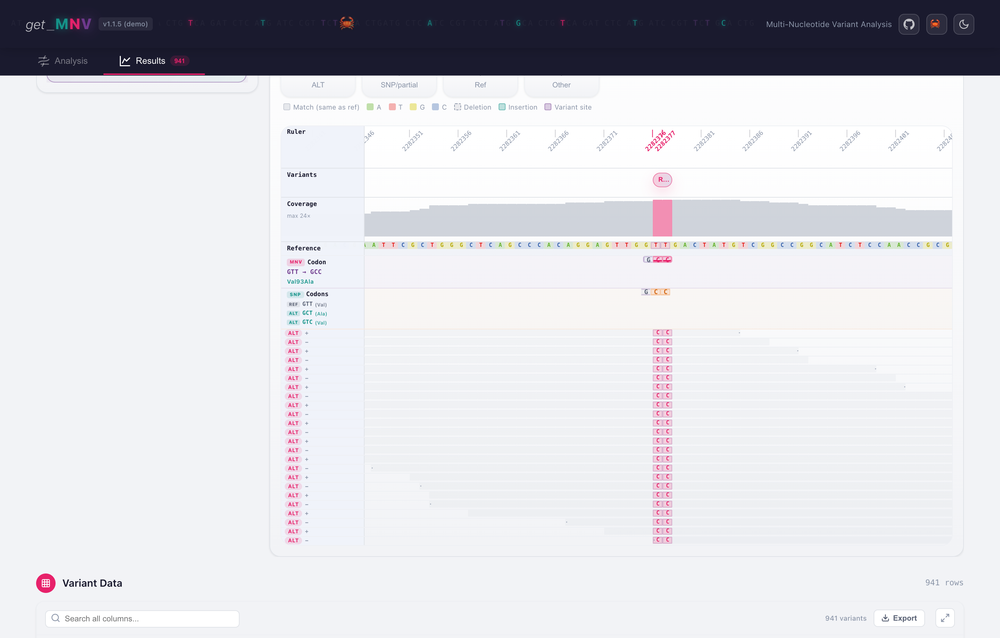
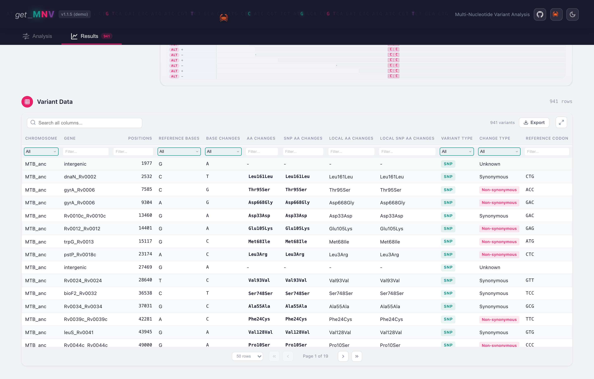

# Desktop GUI Tutorial

A complete run of the desktop app on the data that ships with get_MNV, screen by
screen: loading the files, what the parameters change, how to read the summary,
and how to look at the reads behind a call.

If you have not installed the app yet, see [Desktop GUI](gui.md#install). The
same walkthrough on the command line is [Command Line Tutorial](getting-started.md).

!!! note "Where these screenshots come from"
    They are captured from the browser demo in `frontend/demo/`, which renders
    the app's real components against fixture data instead of calling the Rust
    backend. The numbers, the reads and the table are the genuine output of
    `get_mnv` on the files in `example/`; only the plumbing between the form and
    the engine is stood in for, so the pages can be captured without building a
    desktop bundle.

## What you need

Everything is in the [`example/`](https://github.com/PathoGenOmics-Lab/get_MNV/tree/main/example)
folder of the repository:

| File | Role |
|---|---|
| `G35894.var.snp.vcf` | the variant calls |
| `MTB_ancestor.fas` | the reference the calls were made against |
| `anot_genes.txt` | a simple gene table |
| `G35894.demo.bam` (+ `.bai`) | a small alignment, for read support |

## 1. Load the inputs



Drop each file on its zone, or click to browse. Three are required and marked
with a red asterisk; the counter reads **3/3 required + BAM** once they are set,
and the Run button turns on.

- **Variant calls** takes a plain or BGZF-compressed VCF, or an iVar
  `variants.tsv`. The app detects which it is from the file.
- **FASTA reference** must be the reference the variants were called against.
  get_MNV writes the `.fai` index itself if it is missing.
- **Gene annotation** takes a GFF/GFF3 or a simple gene table. `anot_genes.txt`
  is a gene table, so no GFF feature picker appears; load a GFF and a **GFF
  features** panel shows up where you choose which feature types to read
  (`gene,pseudogene` by default, `CDS` for spliced transcripts).
- **BAM alignment** is optional, and it is what turns an annotation into
  evidence. Without it, get_MNV reports what your caller said. With it, it counts
  the reads itself and can tell a real codon-level haplotype from two
  substitutions that never shared a molecule. See [Linkage](linkage.md).

## 2. Set the parameters



The sidebar groups every knob the app exposes, and the four preset chips at the
top set them in bulk. The moment you change one, the preset chip switches to
**Custom**, which is what the screenshot above shows.

!!! warning "Why this screenshot shows 0 and not the default 2"
    The form ships with **Min SNP reads** and **Min MNV reads** at `2`, and those
    thresholds only apply when a BAM is loaded. `G35894.demo.bam` is a tiny
    demonstration file that covers a single locus, so with the default floor
    every other row loses its support and the output drops from 941 rows to 1.
    Both are set to `0` here for that reason; on a real alignment, leave them
    alone. The [Command Line Tutorial](getting-started.md#5-filter-on-that-support)
    explains how the two thresholds combine, which is not obvious.

Five of the form's defaults are deliberately stricter than the CLI's; they are
listed in [Desktop GUI](gui.md#where-the-form-differs-from-the-cli). Everything
the form does not show falls back to the CLI default.

## 3. Run



The button reports the phase it is in as it goes. A run over this dataset takes
well under a second; the progress bar matters on cohorts, where you can queue
several matched samples and let them run in one batch.

## 4. Read the summary



The top row is the shape of the run: **941 variants** produced from **950 VCF
records** over **635 mapped genes** on **1 contig**. Records and variants differ
because a codon carrying two substitutions is reported once.

**Variant breakdown** is the part worth reading slowly:

| Row | Here | What it counts |
|---|---:|---|
| SNP | 797 | one substitution in a codon |
| MNV | 0 | a single VCF record that already carried more than one substituted base |
| SNP/MNV | 10 | separate VCF records that get_MNV found in the same codon |
| Indel | 0 | insertions and deletions |
| Intergenic | 134 | outside any annotated gene |

`MNV` is `0` and `SNP/MNV` is `10` because this caller emitted one record per
base. Those ten rows are what a per-SNV annotator would have reported as twenty
independent substitutions with the wrong amino acids, and they are the reason
the tool exists.

Below, **per-contig breakdown** repeats the figures per sequence, and **output
files** shows what was written, with a button to reveal it in your file manager.

## 5. Look at the reads

Search the locus list for `Rv2036` and open it. This is the codon that
[Command Line Tutorial](getting-started.md) walks through.



The tracks line up column by column over the same coordinates:

- the **ruler**, with the two variant positions marked in red
  (`2282376`, `2282377`);
- **coverage**, peaking at 24x here;
- the **reference** sequence;
- the **codon tracks**: reference `GTT`, the individual SNP codons `GCT` and
  `GTC`, and the combined **MNV codon `GCC`**;
- the **read pileup**, one row per read, each labelled with the support it gives
  and the strand it came from.

All 24 reads are marked `ALT`, 12 on each strand, and the row reports
`MNV Frequencies 1.0000`. Read separately, the two substitutions say different
things: `GCT` alone is Val93Ala, `GTC` alone is Val93Val, a silent change.
Together they make `GCC`, which is Ala. That is a call you cannot get right one
base at a time.

!!! tip "Why the SNP read counts are zero"
    The row shows `SNP Reads 0, 0` next to `MNV Reads 24`. `SNP Reads` counts
    reads that carry one substitution **without** the full haplotype. Here every
    read carries both, so none is counted as solo support and all 24 sit in
    `MNV Reads`. The two columns split the evidence rather than double-count it.
    See [Output formats](output-formats.md#default-tsv-output).

## 6. Filter and export



The table holds every row of the TSV. Search across all columns, or filter one
at a time: the dropdowns take a value, the text boxes match as you type. Sort by
clicking a header, expand to full screen, and **Export** writes the current view
to TSV or VCF.

## The same run on the command line

The form state in these screenshots is the app's defaults with the two read
floors lowered, which on the command line is:

```bash
get_mnv \
  --vcf example/G35894.var.snp.vcf \
  --fasta example/MTB_ancestor.fas \
  --genes example/anot_genes.txt \
  --bam example/G35894.demo.bam \
  --min-mapq 20 --normalize-alleles --split-multiallelic
```

`--snp` and `--mnv` are already `0` on the command line, so they need no flag.
Add `--snp 2 --mnv 2` to get what the form does untouched, and on this dataset
the output falls to the single row that has read support.

## Where to go next

- [Output formats](output-formats.md) for what every column means.
- [Linkage](linkage.md) for how get_MNV decides that variants really travel
  together.
- [CLI reference](cli-reference.md) for the options the form does not expose.
