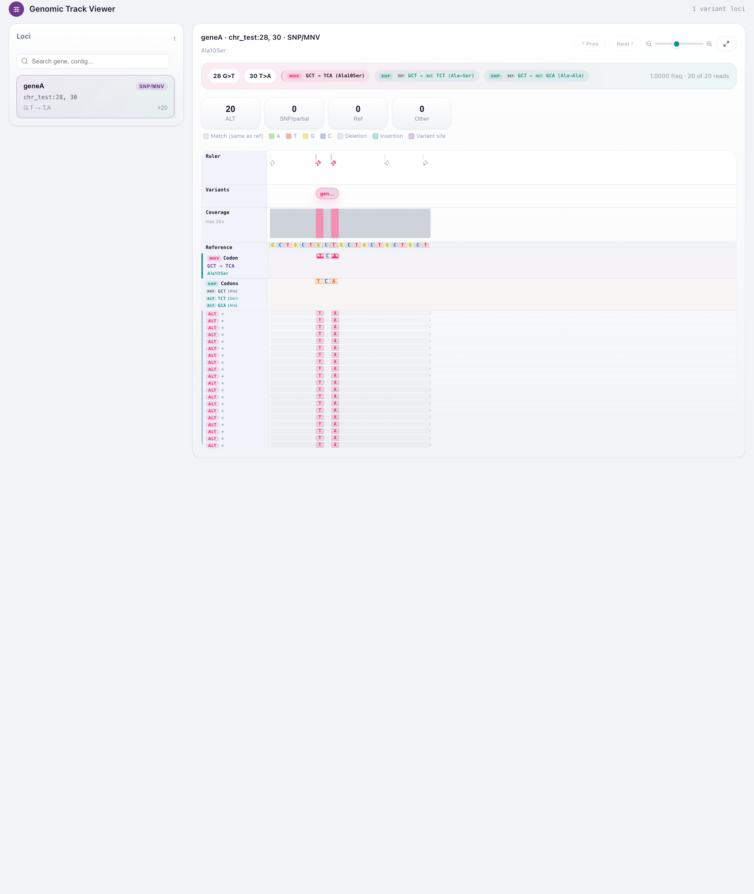

# Desktop GUI

get_MNV ships a native desktop application that runs the same analysis engine as
the command line, with drag-and-drop inputs and an interactive results viewer.

## Install

Download the latest build for your platform from the
[Releases page](https://github.com/PathoGenOmics-Lab/get_MNV/releases/latest).

!!! note "macOS users"
    The app is not signed with an Apple Developer certificate. On first launch,
    right-click the app → **Open** → click **Open** in the dialog.

## Workflow

1. **Add inputs.** Drop your variant file (VCF or iVar TSV), the reference FASTA,
   a gene annotation (GFF/GFF3 or a genes TSV) and, optionally, a coordinate-
   sorted indexed BAM.
2. **Set parameters.** The form exposes the common options — genetic code,
   quality and MAPQ thresholds, SNP/MNV read-count, frequency and strand filters,
   and the indel-tuning knobs. Defaults match the CLI.
3. **Run.** Analyze a single sample, or several matched samples in one batch.
4. **Inspect and export.** Browse, sort and filter the results table, then
   export to TSV or VCF.

## Genomic track viewer

<div style="text-align: center;" markdown>
{ width="840" }
</div>

*The track viewer for an MNV (`GCT → TCA`, Ala10Ser): codon tracks plus the read pileup, with the ALT bases highlighted across all 20 supporting reads.*

Selecting a variant row opens an IGV-style view that lines up, column by column:

- a **ruler** marking the variant positions and the displayed window;
- the **reference** sequence and per-position **coverage**;
- **codon tracks** showing the reference codon, the individual SNP codons and the
  combined MNV codon, with the resulting amino acid change;
- the **read pileup**, one row per supporting read, with the ALT bases
  highlighted and reads coloured by the support they provide (MNV / partial /
  reference).

This makes it easy to confirm visually that the reads carry the combined codon
change, not just the individual SNVs.

!!! tip "Try it with the example"
    Follow the [Getting Started](getting-started.md) tutorial and load the
    bundled `example/G35894.demo.bam`. Opening the `Rv2036` row shows all 24
    reads carrying both ALT bases of the `GTT → GCC` (Val93Ala) codon.

!!! note "Read viewer requirements"
    The pileup needs a coordinate-sorted, indexed BAM (`.bai`) and an indexed
    FASTA (`.fai`); get_MNV creates the FASTA index automatically when needed.
    Rows without read data still show the codon and amino-acid tracks.

## Build from source

The GUI is a [Tauri](https://tauri.app/) app (Rust backend + web frontend). To
run it from a checkout:

```bash
bash scripts/dev.sh                # development
bash scripts/build_gui_bundle.sh   # production .app / .dmg bundle
```
