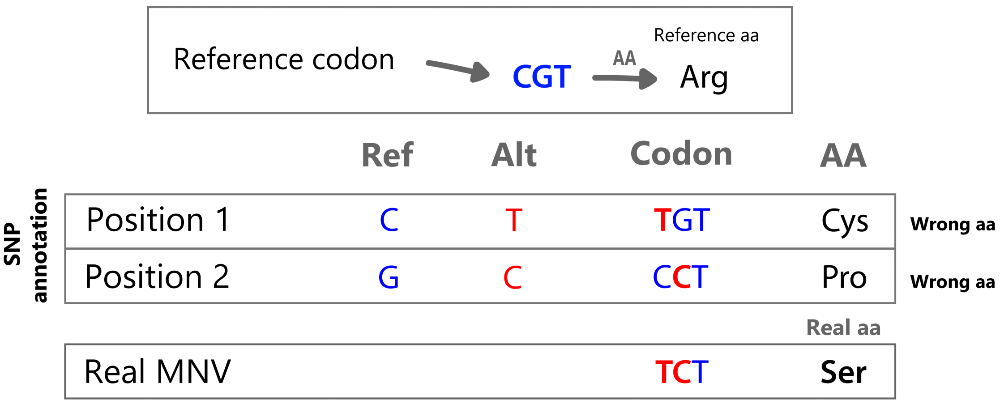

# get_MNV

**Codon-level Multi-Nucleotide Variant detection and indel annotation from VCF or iVar TSV.**
Pure Rust · no C dependencies · cross-platform (macOS, Linux, Windows).

get_MNV finds cases where two or more SNVs fall in the **same codon** and should
be interpreted together. These combined changes can produce a different amino
acid effect than the individual SNVs alone.

<div style="text-align: center;" markdown>
{ width="620" }
</div>

## The problem, in one codon

That is the figure above, in words. A codon reads `CGT` and codes arginine, and a
caller reports two substitutions inside it:

| Read as | Codon | Amino acid |
|---|---|---|
| Reference | `CGT` | Arg |
| Position 1 alone, `C>T` | `TGT` | Cys |
| Position 2 alone, `G>C` | `CCT` | Pro |
| **Both together** | `TCT` | **Ser** |

An annotator that takes each substitution on its own reports a cysteine and a
proline. Neither happens. If the two changes sit on the same molecule, the protein
carries a serine, which is the answer get_MNV gives.

Whether they really do sit on the same molecule is a separate question, and with
a BAM get_MNV counts the reads that carry both rather than assuming:
see [Linkage](linkage.md).

## What it does with them

| Step | What it reads | What it produces |
|---|---|---|
| 1. Decompose | the `REF`/`ALT` pair of each record | the individual changes it holds: SNV, MNV, insertion, deletion, delins |
| 2. Place | the reference and the gene annotation | which feature each change falls in, and which codon |
| 3. Translate | the whole codon, not one base at a time | the amino acid the codon actually gives |
| 4. Count *(with a BAM)* | the aligned reads | how many carry each change, and whether they travel together |
| 5. Write | everything above | a TSV, a VCF, and a self-contained HTML report |

Steps 1 to 3 need no reads. A BAM only adds step 4, which is what turns "these
two changes are in one codon" into "these two changes are on one molecule".

## What it takes

| Input | Format |
|---|---|
| Variant calls | VCF or iVar `variants.tsv` |
| Reference sequence | FASTA |
| Gene annotation | GFF/GFF3/GTF or a simple TSV |
| Aligned reads *(optional)* | BAM, to count SNP/MNV/indel event support |

It writes annotated variants as TSV, VCF, or both.

## Main features

- Groups SNVs by codon and reports **SNP**, **MNV**, or **SNP/MNV** calls.
- Recalculates amino acid changes from the **full codon haplotype**.
- Decomposes `REF/ALT` alleles into SNV, MNV, insertion, deletion, delins, and
  complex indel components.
- Reads VCF and iVar TSV, including iVar `+SEQ` / `-SEQ` indel notation.
- Uses BAM reads (when provided) for SNP/MNV support, exact indel event support,
  and strand bias.
- Supports 9 NCBI genetic code tables.
- Writes a self-contained interactive HTML report:
  [see an example](assets/example-report.html){ target=_blank }.
- Includes a desktop GUI for drag-and-drop analysis.

## Installation

=== "Desktop GUI"

    Download the latest release for your platform from the
    [Releases page](https://github.com/PathoGenOmics-Lab/get_MNV/releases/latest).

    !!! note "macOS users"
        The app is not signed with an Apple Developer certificate. On first
        launch, right-click the app → **Open** → click **Open** in the dialog.

=== "Command line"

    ```bash
    conda install -c bioconda get_mnv
    ```

    Or build from source:

    ```bash
    git clone https://github.com/PathoGenOmics-Lab/get_MNV.git
    cd get_MNV
    cargo install --path .
    ```

## Quick start

```bash
get_mnv \
  --vcf variants.vcf \
  --fasta reference.fasta \
  --gff genes.gff3
```

A ready-to-run *M. tuberculosis* dataset (reference, genes, VCF, and a tiny demo
BAM for the read viewer) lives in the
[`example/`](https://github.com/PathoGenOmics-Lab/get_MNV/tree/main/example)
folder of the repository.

## Where to go next

<div class="grid cards" markdown>

-   :material-console:{ .lg .middle } **Command Line Tutorial**

    ---

    A first run end to end on the bundled example data, with the output
    explained line by line.

    [:octicons-arrow-right-24: Start here](getting-started.md)

-   :material-book-open-variant:{ .lg .middle } **Common Recipes**

    ---

    Ready-to-run commands for the usual jobs: a cohort, an iVar table, a
    compressed VCF, a report from existing runs.

    [:octicons-arrow-right-24: Recipes](usage.md)

-   :material-format-list-bulleted:{ .lg .middle } **CLI Reference**

    ---

    Every option with its default, and what each one changes about the answer.

    [:octicons-arrow-right-24: Reference](cli-reference.md)

-   :material-table:{ .lg .middle } **Output Formats**

    ---

    What each TSV column, VCF INFO key and JSON field means, and when a value
    is absent rather than zero.

    [:octicons-arrow-right-24: Columns and fields](output-formats.md)

-   :material-link-variant:{ .lg .middle } **Linkage**

    ---

    Telling a real haplotype from two variants that merely share a codon, using
    the molecules that carry them.

    [:octicons-arrow-right-24: D prime and its p-value](linkage.md)

-   :material-lifebuoy:{ .lg .middle } **Troubleshooting**

    ---

    The input mismatches that stop a run, and what each message is asking for.

    [:octicons-arrow-right-24: Get unstuck](troubleshooting.md)

</div>

## Citation

If you use get_MNV, please cite it via its
[Zenodo DOI](https://doi.org/10.5281/zenodo.13907423).

## License

get_MNV is released under the **AGPL-3.0** license.
